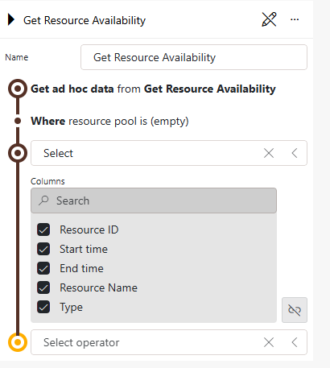

# SLC-GQIDS-GetResourceAvailability

This repository contains a GQI ad-hoc data source to fetch the availability of a Resource.

> [!Warning]
> Minimum required DataMiner version 10.5.3.

This custom data source returns the time spans in which resources are unavailable based on their availability window (see [Resource availability](https://docs.dataminer.services/user-guide/Advanced_Modules/SRM/SRM_Resource_Availability.html)). Resources that do not have an availability window will return a row as well, with no value for the 'Start Time', 'End Time' and 'Type' columns. This allows for the display of resources without an availability window on a timeline component.

## Features

- The resources can optionally be filtered by pool using an input argument.
- Live updates when resources are added, updated or removed.
- Resources are loaded in a paged manner.

The data source will return the following columns:

| **Column**    	| **Description**                                                                                                                                               	|
|---------------	|---------------------------------------------------------------------------------------------------------------------------------------------------------------	|
| Resource ID   	| ID of the resource                                                                                                                                            	|
| Start Time    	| Start time of the unavailability of the resource                                                                                                              	|
| End Time      	| End time of the unavailability of the resource                                                                                                                	|
| Resource Name 	| Name of the resource                                                                                                                                          	|
| Type          	| Either 'Fixed', if the start of this unavailability is not time-dependent, or 'RollingWindow' if the start of the unavailability moves as a rolling window.   	|

> [!Warning]
> If a pool filter is not used, all resources on the system will be returned by the data source. When the query is linked to a timeline component, the timeline component will read all pages before displaying anything. On systems with a large amount of resources that can cause performance issues.

## How to use

1. Install the Data Source.
1. Create a new query in you dashboard or app.
1. Select "Get ad hoc data".
1. Select "Get Resource Availability".
1. Optionally fill in the ID of a resource pool, or link the value to a different component.

## Screenshots

